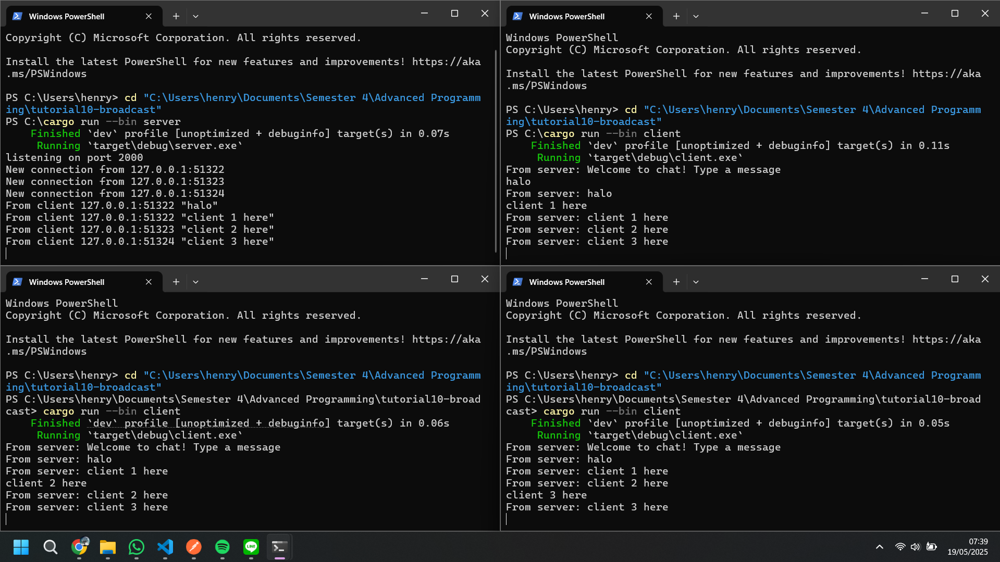
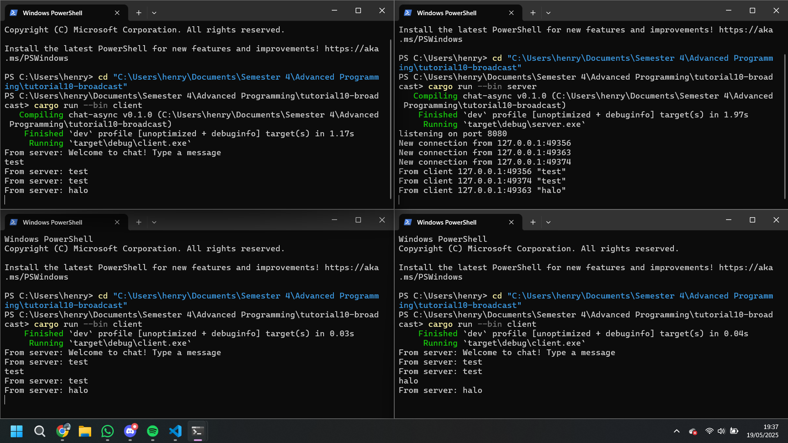
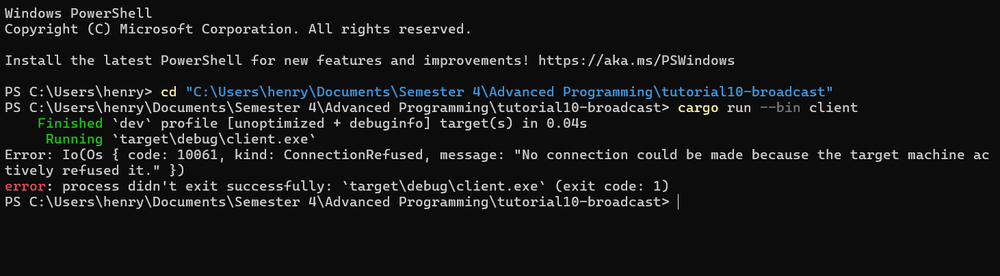

# Experiment README
## Experiment 2.1: Original code, and how it run

Untuk menjalankan server dan tiga client, maka buka terminal dan jalankan perintah cargo run --bin server untuk memulai server. Server lalu akan mendengarkan connection pada port 2000. Setelah server berjalan, buka tiga terminal lain untuk client dan jalankan perintah cargo run --bin client di masing-masing terminal untuk menjalankan tiga instance client secara paralel.  

Pada screenshot di atas, terlihat bahwa server berhasil menerima koneksi dari tiga client (127.0.0.1 dengan port berbeda), lalu masing-masing client mengirim pesan seperti "client 1 here", "client 2 here", dan "client 3 here". Pesan-pesan ini kemudian diteruskan kembali oleh server ke seluruh client yang sedang terhubung, yang ditandai dengan munculnya output seperti from server client 2 here di client lainnya.

## Experiment 2.2: Modifying port
  
 

  
 

Setelah mengganti port server dan client menjadi 8080, maka aplikasi tetap dapat berjalan dengan baik seperti sebelumnya. Hal ini karena baik server maupun client sama sama menggunakan port yang sama, yaitu 8080, sehingga koneksi berhasil dilakukan. Untuk memodifikasi portnya, saya ubah bagian `TcpListener::bind` di file `server.rs` menjadi `"127.0.0.1:8080"` dan juga URI di file `client.rs` menjadi `"ws://127.0.0.1:8080"`. Selama port yang digunakan di kedua sisi sama, maka antara client dan server akan tetap berhasil berkomunikasi. Namun jika hanya salah satu yang diubah, maka client akan gagal connect karena tidak menemukan server di port yang dimaksud. 